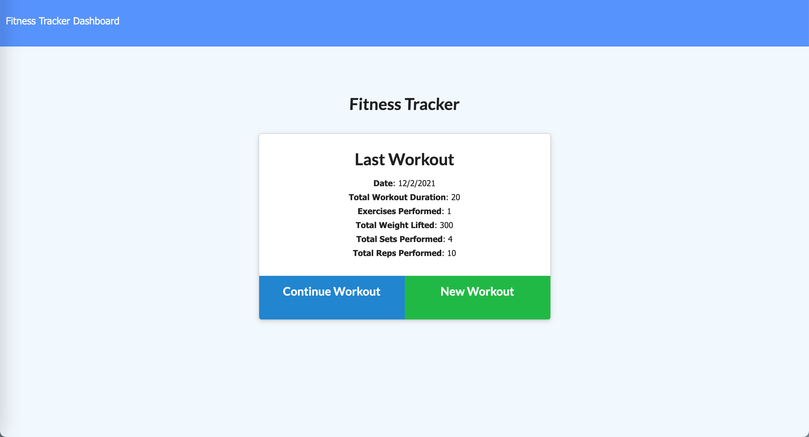
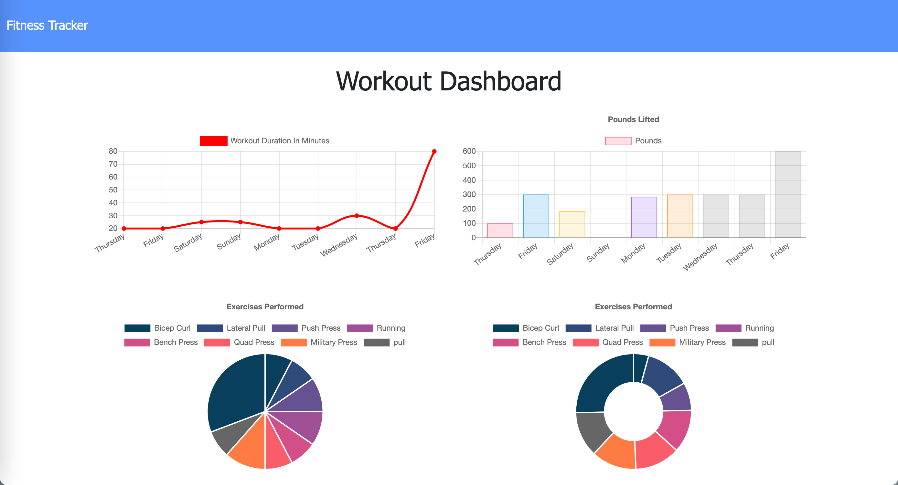

# Workout_Tracker
This a simple Workout Tracker to help you completely  track your everyday workout an let you improve every day.

## User Story

* As a user, I want to be able to view create and track daily workouts. I want to be able to log multiple exercises in a workout on a given day. I should also be able to track the name, type, weight, sets, reps, and duration of exercise. If the exercise is a cardio exercise, I should be able to track my distance traveled.

The user should be able to:

  * Add exercises to the most recent workout plan.

  * Add new exercises to a new workout plan.

  * View the combined weight of multiple exercises from the past seven workouts on the `stats` page.

  * View the total duration of each workout from the past seven workouts on the `stats` page.

## Business Context

A consumer will reach their fitness goals more quickly when they track their workout progress.

## Heroku app
​
* **HEROKU APP** [HEROKU APP](https://fitness0alhe.herokuapp.com/)

## CONTRIBUTE

* **GITHUB REPOSITORY** [HEROKU APP](https://github.com/AlheliMi/Workout_Tracker.git)

* **Alhelí Miranda Campos** [Github: AlheliMi](https://github.com/AlheliMi)
